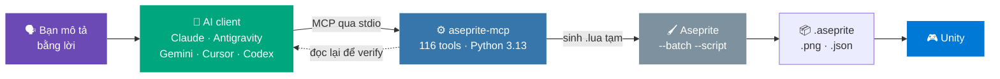

<div align="center">

# 🎨 AsepriteMCP

**Biến Aseprite thành một công cụ mà AI gọi được.**

Mô tả sprite bằng lời — AI vẽ, tạo animation, kiểm chứng và export thẳng vào pipeline Unity.


</div>

---

> **Điểm khác biệt:** repo này không khoá vào một AI nào. Claude Code ở công ty, Antigravity ở nhà,
> Gemini hay Cursor trên máy thứ ba — cùng một prompt, cùng một bộ rule, cùng một hành vi.

# Mục lục

1. [Dự án này là gì](#1-dự-án-này-là-gì)
2. [Cách nó hoạt động](#2-cách-nó-hoạt-động)
3. [Bắt đầu nhanh](#3-bắt-đầu-nhanh)
4. [Client nào đọc file nào](#4-client-nào-đọc-file-nào)
5. [Dùng hàng ngày](#5-dùng-hàng-ngày)
6. [Vì sao phải có playbook](#6-vì-sao-phải-có-playbook)
7. [Cấu trúc repo](#7-cấu-trúc-repo)
8. [Sửa rule, recipe hay skill](#8-sửa-rule-recipe-hay-skill)
9. [Giới hạn đã biết](#9-giới-hạn-đã-biết)
10. [Xử lý sự cố](#10-xử-lý-sự-cố)
11. [Tài liệu & nguồn](#11-tài-liệu--nguồn)

---

# 1. Dự án này là gì

Aseprite là công cụ pixel art, nhưng nó chỉ nhận thao tác chuột và Lua script. AsepriteMCP nối nó
vào AI qua **Model Context Protocol**, để bạn làm việc bằng câu chữ thay vì từng cú click:

<table>
<tr><th width="50%">🎯 Dùng để làm gì</th><th width="50%">🚫 Không phải cái gì</th></tr>
<tr valign="top"><td>

- **Vẽ & sửa pixel art** — sprite, tile, icon, item
- **Animation nhiều frame** — idle, walk, attack, hurt
- **Batch xử lý asset** — recolor, resize, đổi format
- **Tự động export** — sprite sheet + JSON metadata
- **Kiểm chứng chất lượng** — `/asset-qc` soi lại thành phẩm

</td><td>

- **Không phải dự án viết MCP server.** Dùng server có sẵn
  [`diivi/aseprite-mcp`](https://github.com/diivi/aseprite-mcp)
  (MIT, 116 tools), gắn ở `vendor/` dưới dạng submodule.
- **Không khoá vào một AI client.** Mọi rule và cấu hình đều
  sinh ra cho cả 6 client.
- **Không thay thế hoạ sĩ.** Điểm mạnh thật của AI nằm ở khâu
  *augment* — xem [mục 6](#6-vì-sao-phải-có-playbook).

</td></tr>
</table>

Đầu ra nhắm thẳng vào **pipeline game Unity**: ưu tiên thứ Unity đọc được ngay, không đẻ format
trung gian phải convert thêm.

---

# 2. Cách nó hoạt động



Mũi tên đứt nét là phần quan trọng nhất và cũng hay bị bỏ qua nhất: **server không trả ảnh về cho
model**. AI không tự nhìn thấy thứ nó vừa vẽ, nên nó buộc phải gọi tool đọc lại để kiểm chứng.
Toàn bộ bộ recipe trong repo này được thiết kế quanh sự thật đó.

---

# 3. Bắt đầu nhanh

**Cần sẵn:** Git · [Node.js](https://nodejs.org) · [uv](https://docs.astral.sh/uv/) ·
Aseprite (cài ở đường dẫn ổn định)

```bash
# 1️⃣  Clone KÈM submodule — thiếu cờ này thì vendor/aseprite-mcp sẽ rỗng
git clone --recurse-submodules https://github.com/hieu180704/AsepriteMCP.git
cd AsepriteMCP
#    Lỡ clone thiếu:  git submodule update --init --recursive

# 2️⃣  Cài dependency của server
uv --directory vendor/aseprite-mcp sync

# 3️⃣  Sinh cấu hình MCP cho mọi client trên máy này
node scripts/setup-mcp.js

# 4️⃣  Đồng bộ rules / recipes / skills ra các client
node scripts/sync-agents.js

# 5️⃣  Bật hook chống lệch tài liệu
git config core.hooksPath .githooks

# 6️⃣  Kiểm tra lại
node scripts/setup-mcp.js  --check
node scripts/sync-agents.js --check
```

Mở lại AI client — nó sẽ thấy 116 tool `aseprite`. Xong.

<details>
<summary><b>Nếu bước 3 không dò ra <code>uv</code> hoặc Aseprite</b></summary>

<br>

Script tự dò các vị trí cài phổ biến, kể cả bản portable trong `Downloads/`. Dò không ra thì nó nói
rõ thiếu gì. Khi đó copy `mcp.local.example.json` thành `mcp.local.json` và điền tay:

```json
{
  "UV_BIN": "C:\\Users\\<user>\\.local\\bin\\uv.exe",
  "ASEPRITE_PATH": "C:\\Program Files\\Aseprite\\Aseprite.exe"
}
```

`mcp.local.json` bị gitignore — đường dẫn máy cá nhân không bao giờ lọt vào repo.

</details>

<details>
<summary><b>Hai client cần thêm một thao tác tay</b></summary>

<br>

Config MCP của chúng nằm ngoài repo nên script chỉ sinh sẵn nội dung để copy:

| Client | Việc phải làm |
| :--- | :--- |
| **Codex CLI** | Copy `.codex/config.snippet.toml` vào `~/.codex/config.toml` |
| **Antigravity** | Import khối `mcpServers` trong `mcp-config.generated.json` vào phần cấu hình MCP của IDE |

</details>

---

# 4. Client nào đọc file nào

| Client | Ngữ cảnh & rules | Cấu hình MCP | Hooks |
| :--- | :--- | :--- | :---: |
| **Claude Code / Desktop** | `CLAUDE.md` + `.claude/rules/` + `.claude/commands/` | `.mcp.json` | ✅ |
| **Antigravity** | `AGENTS.md` + `.agents/rules/` | `mcp-config.generated.json` <sup>tay</sup> | ✅ |
| **Gemini CLI** | `GEMINI.md` + `.agents/rules/` | `.gemini/settings.json` | — |
| **Codex CLI** | `AGENTS.md` + `.agents/rules/` | `~/.codex/config.toml` <sup>tay</sup> | — |
| **Cursor** | `.cursor/rules/*.mdc` | `.cursor/mcp.json` | — |
| **VS Code / Copilot** | `AGENTS.md` | `.vscode/mcp.json` | — |
| **ChatGPT web** | dán `.openai/system-prompt.txt` | không chạy MCP được | — |

Mọi entry point ở cột giữa đều chứa **cùng một khối ràng buộc cứng**, nằm giữa cặp marker
`<!-- BEGIN synced-hard-constraints -->`, sinh từ `.agents/shared/hard-constraints.md`.
Đó là thứ bảo đảm Claude và Gemini không hành xử khác nhau.

---

# 5. Dùng hàng ngày

Bạn **không chạy lệnh nào cả** — chỉ nói chuyện với AI. Repo đã nạp sẵn rule để AI tự chọn đúng
quy trình.

### 🧍 Vẽ sprite tĩnh

```text
Vẽ một knight 32×32 nhìn chính diện, tông thép xanh, palette pico-8.
Xuất PNG scale 4x vào D:/Project/AsepriteMCP/Output/knight/
```

<details>
<summary>AI sẽ đi qua 7 bước của <code>aseprite-static-sprite.md</code></summary>

<br>

| Bước | Việc |
| :--- | :--- |
| 1 | Chốt thông số trước khi gọi tool — kích thước, color mode, layer plan |
| 2 | `create_canvas` + tạo layer theo plan |
| 3 | **Chốt palette** — `apply_palette_preset`, đổi sau khi vẽ là không cứu được |
| 4 | Dựng silhouette bằng shape primitives |
| 5 | Shading bằng màu lấy từ `generate_color_ramp` |
| 6 | Chi tiết và viền |
| 7 | **Kiểm chứng rồi mới export** |

</details>

### 🏃 Animation

```text
Từ knight.aseprite, làm animation walk 6 frame, tag "walk", 100ms mỗi frame.
```

AI dùng `propagate_cels` + `tween_cel_positions` thay vì vẽ lại từng frame — đây là cách duy nhất
giữ nhân vật không biến dạng giữa các frame.

### 🎨 Sửa asset có sẵn

```text
Recolor toàn bộ PNG trong Assets/Enemies/ sang palette mới, resize về 32×32,
export sprite sheet kèm JSON.
```

Đây là nhóm việc AI làm **tốt nhất** — xem [mục 6](#6-vì-sao-phải-có-playbook).

### 🔍 Kiểm chứng

```text
/asset-qc Output/knight/knight.aseprite
```

Chạy trọn bộ: `get_sprite_info` → `get_color_stats` → `validate_scene` → `audit_animation` →
`compare_frames` các frame liền kề → export PNG → soi bằng mắt.

<details>
<summary><b>10 skill khác dùng được ở mọi client</b></summary>

<br>

| Skill | Công dụng |
| :--- | :--- |
| `/asset-qc` | Kiểm chứng trọn bộ một file `.aseprite` |
| `/plan` | Phân rã mục tiêu lớn thành WBS, milestone, DoD |
| `/explain` | Decision Memo 7 phần để chốt giải pháp |
| `/research` | Nghiên cứu đa chiều, lập ma trận so sánh |
| `/verify` | Thẩm định logic, rà mâu thuẫn, checklist nghiệm thu |
| `/doc` | Đồng bộ `Docs/SourceOfTruth/` với thực tế |
| `/newsession` | Đóng gói phiên, sinh worklog + prompt bàn giao |
| `/worktree` | Tạo git worktree độc lập để thử nghiệm |
| `/system-cleanup` | Dọn file rác, bản nháp trùng lặp |
| `/init` | Phỏng vấn bối cảnh, khởi tạo tài liệu dự án mới |

Claude Code đăng ký sẵn thành slash command. Client khác chưa hỗ trợ slash command thì gõ tên
skill, AI sẽ đọc `.agents/skills/<tên>/SKILL.md` rồi làm đúng quy trình trong đó.

</details>

---

# 6. Vì sao phải có playbook

Không phải phỏng đoán — có dữ liệu đo được, ghi đầy đủ trong
[`aseprite-00-playbook.md`](.agents/recipes/aseprite-00-playbook.md).

| Giới hạn thật | Hệ quả lên cách làm |
| :--- | :--- |
| **Vẽ pixel-by-pixel là điểm yếu cấu trúc của LLM.** Benchmark grid 24×24: định dạng hợp lệ 100% nhưng chất lượng chỉ ~0.42/1.0. Fine-tune không cứu được. | Compose bằng **shape primitives**, không rải pixel thủ công cho hình lớn |
| **Character inconsistency** — nhân vật biến dạng giữa các frame dù ý đồ chuyển động đúng | Animation dùng `propagate_cels` + tween, không vẽ lại từng frame |
| **Semantic drift** — vẽ kiếm ra thành súng, nhân vật thành khối màu vô định hình | Layer plan chốt trước, tên layer là khoá tra cứu |
| **Tool blame-shifting** — model tự khẳng định đã gọi tool thành công trong khi tool không chạy | **Giao thức kiểm chứng bắt buộc**: cấm báo "đã xong" khi chưa đọc lại bằng tool |
| **Server không trả ảnh về cho model** (mọi tool `-> str`) | AI phải chủ động verify; client không đọc được ảnh thì phải nói thẳng là chưa nhìn bằng mắt |

**Use-case mạnh nhất không phải "sáng tác từ con số 0"** mà là *augment*: recolor palette, chuẩn
hoá kích thước, batch export, sửa asset có sẵn.

<details>
<summary><b>8 rule cứng — bản rút gọn</b></summary>

<br>

| # | Rule | Vì sao |
| :---: | :--- | :--- |
| **R1** | Luôn dùng đường dẫn tuyệt đối | Đường dẫn tương đối giải theo cwd của server, gãy im lặng |
| **R2** | Chốt palette trước khi vẽ pixel đầu tiên | `apply_palette_preset` chỉ đổi bảng màu, không đổi pixel đã vẽ |
| **R3** | Màu shading lấy từ `generate_color_ramp` | Tự nhân/chia độ sáng ra màu "nhựa" |
| **R4** | Luôn dùng biến thể `*_at` | Bản không hậu tố vẽ lên active cel, mà active cel trôi theo thao tác trước |
| **R5** | Compose bằng shape primitives | `draw_pixels_at` chỉ dành cho chi tiết ≤ ~30 pixel |
| **R6** | Lập layer plan trước, tên layer tiếng Anh không dấu | Tên layer là khoá tra cứu của mọi tool `*_at` |
| **R7** | Canvas nhỏ, mặc định 32×32 | Cần to hơn thì `scale` lúc export |
| **R8** | `run_lua_script` là phương án cuối | Phải nêu lý do trước khi chạy |

</details>

---

# 7. Cấu trúc repo

```text
AsepriteMCP/
├── .agents/                    ← NGUỒN DUY NHẤT của mọi chỉ dẫn cho AI
│   ├── shared/                    khối ràng buộc cứng, nhúng vào mọi entry point
│   ├── rules/                     5 rule nạp thường trực
│   ├── recipes/                   playbook Aseprite + 6 mẫu tư duy
│   ├── skills/                    10 skill dạng /command
│   ├── hooks/                     guard chạy được trên mọi client
│   └── hooks.json                 khai báo hook kiểu Antigravity
│
├── .claude/  .cursor/          ← BẢN SINH, đừng sửa tay
├── AGENTS.md  CLAUDE.md  GEMINI.md  CHATGPT.md   ← entry point từng client
├── .cursorrules  .openai/system-prompt.txt
│
├── scripts/
│   ├── sync-agents.js             .agents/ → mọi client  (--check để kiểm tra)
│   └── setup-mcp.js               sinh config MCP cho 6 client
│
├── mcp-servers.template.json   ← nguồn khai báo MCP server
├── mcp.local.example.json         mẫu đường dẫn riêng từng máy
├── .githooks/pre-commit           chặn commit khi bản sinh lệch
│
├── Docs/
│   ├── SourceOfTruth/             tri thức gốc — đọc overview.txt trước
│   ├── Decisions/                 nhật ký quyết định
│   ├── QC/                        tiêu chí nghiệm thu
│   ├── Done/                      worklog từng đầu việc
│   └── Handoffs/                  bàn giao giữa các phiên
│
├── vendor/aseprite-mcp/        ← submodule upstream, không sửa
└── Output/                        sản phẩm sinh ra (gitignore)
```

---

# 8. Sửa rule, recipe hay skill

**Nguồn duy nhất là `.agents/`.** Đây là sơ đồ sinh file:

```text
.agents/shared/hard-constraints.md ─┬─► AGENTS.md                  Antigravity · Codex · Copilot
                                    ├─► CLAUDE.md                  Claude Code
                                    ├─► GEMINI.md                  Gemini CLI
                                    ├─► CHATGPT.md                 ChatGPT / Codex
                                    ├─► .cursorrules               Cursor bản cũ
                                    └─► .openai/system-prompt.txt  ChatGPT web

.agents/rules/*.md            ──► .claude/rules/*.md  +  .cursor/rules/*.mdc
.agents/recipes/*.md          ──► .claude/recipes/*.md
.agents/hooks/*.js            ──► .claude/hooks/*.js
.agents/skills/<tên>/SKILL.md ──► .claude/commands/<tên>.md
```

Quy trình: **sửa trong `.agents/` → `node scripts/sync-agents.js` → commit cả nguồn lẫn bản sinh.**

> [!WARNING]
> Sửa thẳng vào bản sinh sẽ bị ghi đè ở lần sync sau, và **không bao giờ đến được các model khác**.
> Script còn xoá file mồ côi trong các thư mục sinh hoàn toàn. Muốn thêm command riêng thì tạo skill
> trong `.agents/skills/`, đừng bỏ file trực tiếp vào `.claude/commands/`.

Hook `pre-commit` chạy `sync-agents.js --check` và chặn commit nếu có gì lệch — nên không thể quên.

**Đổi đường dẫn Aseprite hoặc uv:** chạy lại `node scripts/setup-mcp.js` rồi mở lại client. Thêm
MCP server khác thì thêm vào `mcp-servers.template.json`, mọi client nhận cùng lúc.

---

# 9. Giới hạn đã biết

Ghi ra để không ai phải tự phát hiện lại:

- ⚠️ **Hooks chỉ chạy trên Claude Code và Antigravity.** Script hook đã viết universal, nhưng file
  khai báo hook thì mỗi client một schema, và Cursor / Gemini CLI / Codex CLI chưa được cấu hình.
  Trên các client đó, guard chặn ghi file nhạy cảm **không chạy**.
- ⚠️ **ChatGPT web không gọi được MCP** — chỉ dùng được phần rules, không thao tác Aseprite.
- ⚠️ **Codex CLI và Antigravity cần một bước import tay** vì config MCP của chúng nằm ngoài repo.
- ⚠️ **AI không tự nhìn thấy thứ nó vừa vẽ.** Luôn chạy `/asset-qc` trước khi tin kết quả.

---

# 10. Xử lý sự cố

| Triệu chứng | Nguyên nhân thường gặp | Cách xử lý |
| :--- | :--- | :--- |
| Client không thấy tool `aseprite` nào | Chưa sinh config, hoặc chưa mở lại client | `node scripts/setup-mcp.js` rồi khởi động lại client |
| Tool báo chạy xong nhưng không có gì xảy ra | `ASEPRITE_PATH` sai — server fallback gọi `aseprite` trên PATH | `node scripts/setup-mcp.js --check` |
| `ModuleNotFoundError: aseprite_mcp` | Chưa cài dependency, hoặc submodule chưa init | `uv --directory vendor/aseprite-mcp sync` |
| `vendor/aseprite-mcp` rỗng | Clone thiếu submodule | `git submodule update --init --recursive` |
| `ERROR:Layer not found` | Sai tên layer, hoặc layer nằm trong group | `get_sprite_info` lấy tên chính xác |
| Vẽ xong không thấy gì | Vẽ nhầm layer/frame do dùng bản không `*_at` | Chuyển sang biến thể `*_at` (R4) |
| Sprite trông "nhựa", thiếu chiều sâu | Tự chế màu sáng/tối thay vì dùng ramp | Làm lại palette bằng `generate_color_ramp` (R3) |
| AI ở client này hành xử khác client kia | Bản sinh đã lệch khỏi nguồn | `node scripts/sync-agents.js --check` |
| Pre-commit chặn commit | Quên chạy sync | `node scripts/sync-agents.js` rồi `git add` lại |

---

# 11. Tài liệu & nguồn

| Cần gì | Ở đâu |
| :--- | :--- |
| **Tổng quan dự án — đọc trước tiên** | [`Docs/SourceOfTruth/overview.txt`](Docs/SourceOfTruth/overview.txt) |
| Playbook Aseprite — 8 rule cứng, giao thức verify | [`.agents/recipes/aseprite-00-playbook.md`](.agents/recipes/aseprite-00-playbook.md) |
| Chỉ mục toàn bộ recipe | [`.agents/recipes/00-recipe-index.md`](.agents/recipes/00-recipe-index.md) |
| Ràng buộc cứng dùng chung mọi model | [`.agents/shared/hard-constraints.md`](.agents/shared/hard-constraints.md) |
| Nhật ký quyết định | [`Docs/Decisions/`](Docs/Decisions/) |
| Worklog từng đầu việc | [`Docs/Done/`](Docs/Done/) |
| MCP server upstream | [diivi/aseprite-mcp](https://github.com/diivi/aseprite-mcp) · MIT |
| Model Context Protocol | [modelcontextprotocol.io](https://modelcontextprotocol.io) |

<div align="center">
<br>

**Quy trình làm việc trong repo này:** `explore → propose → confirm → execute`

*Tài liệu là bản sống — thay đổi gì thì cập nhật tài liệu song song.*

</div>
